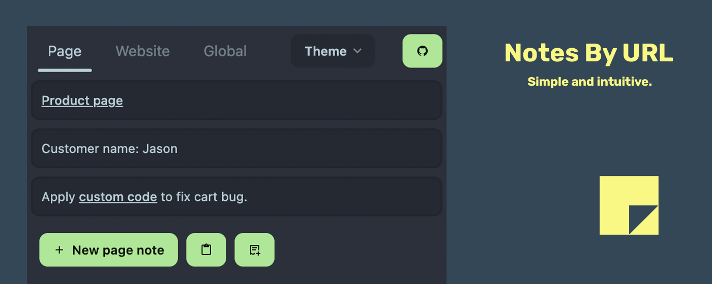
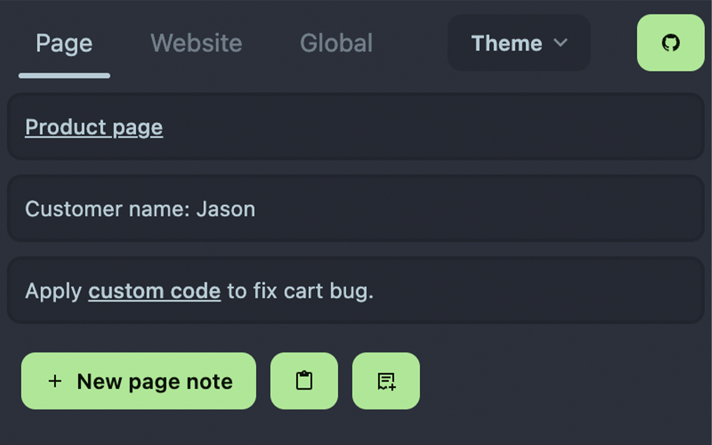
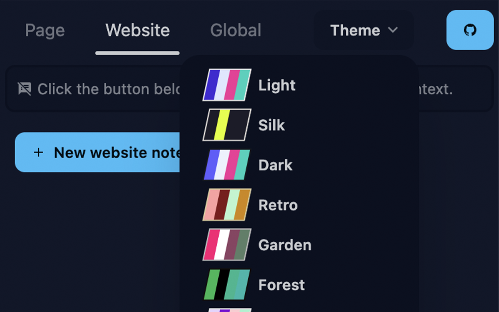

# Notes by URL

A simple note-taking extension that allows you to take notes on any webpage.

## Features

- Take notes on any webpage (The notes will be synced to your browser account if you are logged in)
- Add a note from clipboard or from current selection
- Change visual theme

## Screenshots

## Install

